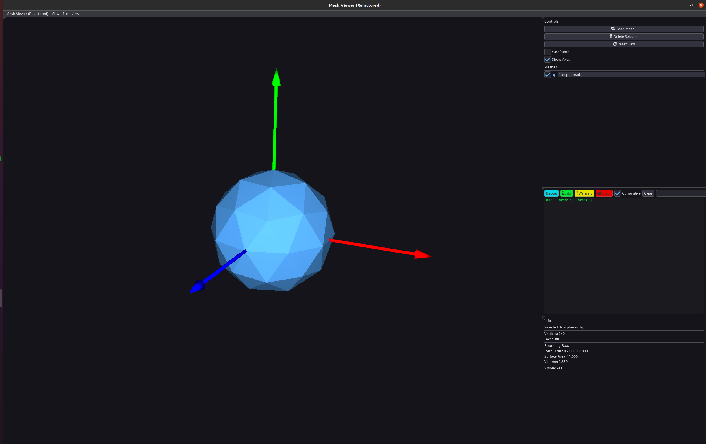

# Mesh Viewer

A simple 3D mesh viewer built with Python and ModernGL. Load and view STL files with an easy-to-use interface.



## What it does

- Load multiple 3D mesh files (STL format)
- View meshes in 3D with camera controls
- Toggle wireframe mode
- Show/hide individual meshes
- Display mesh information (vertices, faces, etc.)

## How to run

1. Install the requirements:
```bash
pip install -r requirements.txt
```

2. Run the application:
```bash
python main.py
```

## How to use

- **Load meshes**: Use File menu
- **Camera**: Mouse to rotate, scroll to zoom
- **View options**: Toggle wireframe, axes, etc.
- **Mesh list**: Check/uncheck to show/hide meshes

## Requirements

- Python 3.11+
- OpenGL support
- See `requirements.txt` for Python packages